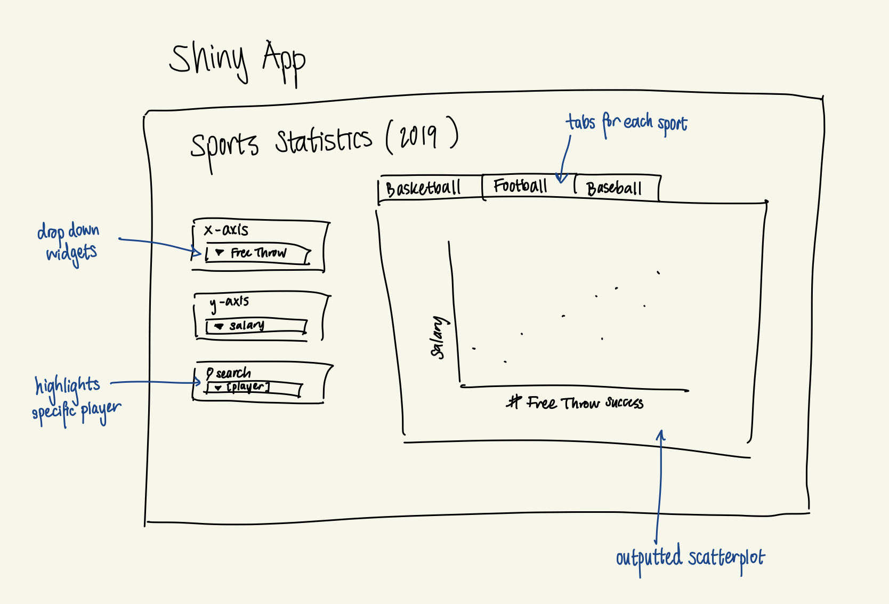

```{r include = FALSE}
library(kableExtra)
```

<!-- Change the title to "Shiny Proposal for Group A# or B#", depending on your section, with your # -->

<!-- For the Revised proposal, add "Revised" to the title -->

Group name: 3Lattes

<!-- The group name will be used as the name of your group repo for both group projects. -->


Title: US Sports Statistics in 2019

<!-- The tentative title of your shiny project -->

# Purpose

<!-- Describe the general topic/phenomena you want to explore, as well as some questions that you hope to address. -->

We want to explore the statistics of Basketball (NBA), Baseball (NBL) and Football (NFL) players during 2019. The question we hope to address is finding the relationship between general in-game statistics (e.g average free throw success, assists, etc) and Win% or Salary. However, we want to make the relationships between the statistics open to explore.

# Data 

<!-- Identify one or more data sources that could be used in the project. What form is the data in (downloadable csv file? needs to be scraped from web?)? What do you imagine will be challenging about ingesting and/or wrangling the data? -->

Data sources:

+ Basketball Game per Data Set (https://www.basketball-reference.com/leagues/NBA_2020_per_game.html#per_game_stats)
+ Football Stats (https://www.pro-football-reference.com/years/2019/scrimmage.htm#receiving_and_rushing)
The following datasets is included in the Lehman package, so we will be accessing the data from there.

+ Baseball Fielding Stats (https://www.baseball-reference.com/leagues/majors/2019-standard-fielding.shtml#players_players_standard_fielding_fielding)
+ Baseball Batting Stats (https://www.baseball-reference.com/leagues/majors/2019-standard-batting.shtml#players_standard_batting)
+ Baseball Pitching Stats (https://www.baseball-reference.com/leagues/majors/2019-standard-pitching.shtml#players_standard_pitching)

We expect challenges in data wrangling for the Basketball data when accounting for multiple observations for the same player. This is due to players being frequently traded within the same season and the dataset itself showing multiple observations for the same player. For the Football dataset, a challenge is standardizing all the variables based on a per-game basis. Lastly, we will have to join all 3 datasets for the Baseball statistics, making sure that we match players with all available statistics.

# Shiny app

<!-- Describe some visualizations, tables, and/or other components you envision including in your Shiny app. What will the interactive components be? -->

We will have 3 tabs that output a scatterplot for a specific sport. On the left side, we will have 3 widgets: one to select the x-axis variable, another to select the y-axis variable, and a search bar to select a player and highlight them on the scatterplot. We will add an interactive component of being able to hover over a point and see a player’s information (name, age, team, etc).

